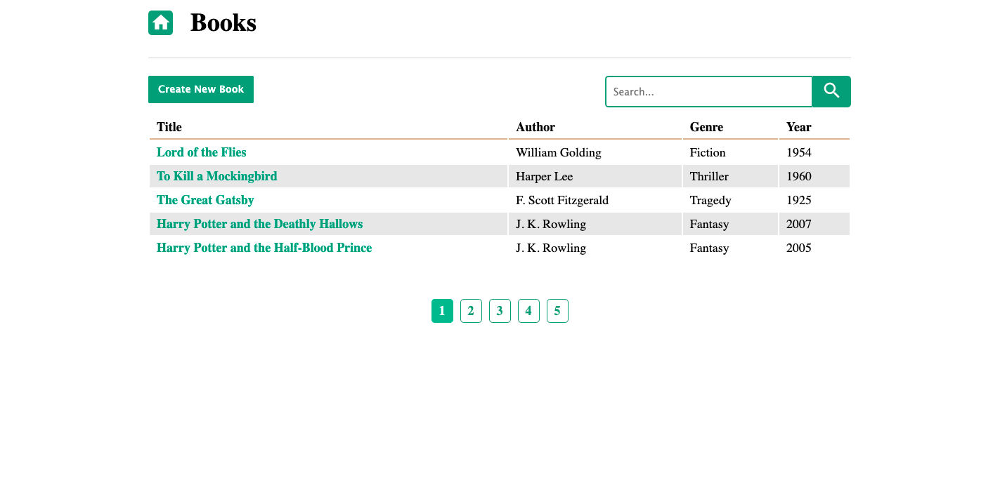

# sql_library_manager

SQLite book library app using CRUD operations, JavaScript, Node.js, Express, Pug, SQLite and the SQL ORM Sequelize.

## Usage

    - type "npm start" to run application
    - open "localhost:3000" in your browser to view application

## Table of Contents

- [sql_library_manager](#sql_library_manager)
  - [Usage](#usage)
  - [Table of Contents](#table-of-contents)
  - [Example](#example)
  - [Models](#models)
  - [Routes](#routes)
  - [Views](#views)

## Example

## Models

    In the models folder the index.js and book.js files create and export all the database and sequelize files required for creating and updating the database. book.js structures the books database's atributes and validation.

## Routes

    All routes are contained in the index.js file for both GET and POST requests.

## Views

    Used pug templating engine to display the content to the webpage
